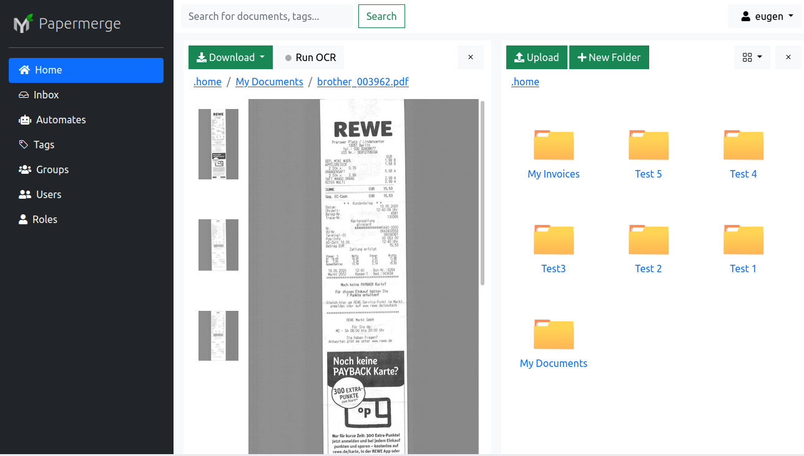

# PapermergeJS

PapermergeJS is frontend part i.e. web-based user interface of Papermerge
Document Management System. It is meant to be used in conjunction with
[Papermerge REST API backend server](https://github.com/papermerge/papermerge-core).

## What is Papermerge DMS?

Papermerge is an open source document management system (DMS) designed
for **digital archives**. Instead of having piles of paper documents all over
your desk, office or drawers - you can quickly scan them and configure your
scanner to directly upload to Papermerge DMS.

## What is a Digital Archive?

Simply put a digital archive is a scanned document. In broader sense, digital
archives are documents whose content does not change in time; a good example of
such **documents are PDF files**. If you take a picture of a document, you'll end
up with a "scanned document" in png, jpeg or whatever format that picture is
stored. In context of papermerge a picture of a document made with you mobile
phone is also a digital archive.

Papermerge **supports pdf, jpeg, png and tiff** file formats.

## Prerequisites

In general, all you need to run this application is a modern web browser like
Google Chrome or Mozilla Firefox, however if you plan to run application in
development mode, you will need some extras:

* [Node.js](https://nodejs.org/) (with npm)
* [Ember CLI](https://ember-cli.com/)

Technically speaking, PapermergeJS is written using [EmberJS](https://emberjs.com/) web framework.

## Installation

* `git clone git@github.com:papermerge/papermerge.js.git` this repository
* `cd papermerge.js`
* `npm install`

## Running / Development

* `ember serve`
* Visit your app at [http://localhost:4200](http://localhost:4200).
* Visit your tests at [http://localhost:4200/tests](http://localhost:4200/tests).

### Running Tests

* `ember test`
* `ember test --server`

### Linting

* `npm run lint`

### Building

* `ember build` (development)
* `ember build --environment production` (production)

